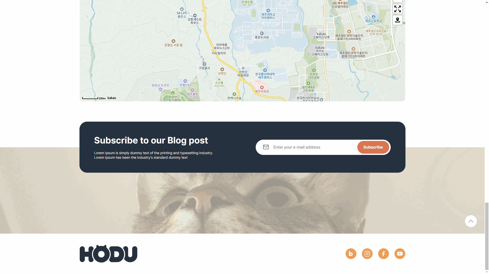
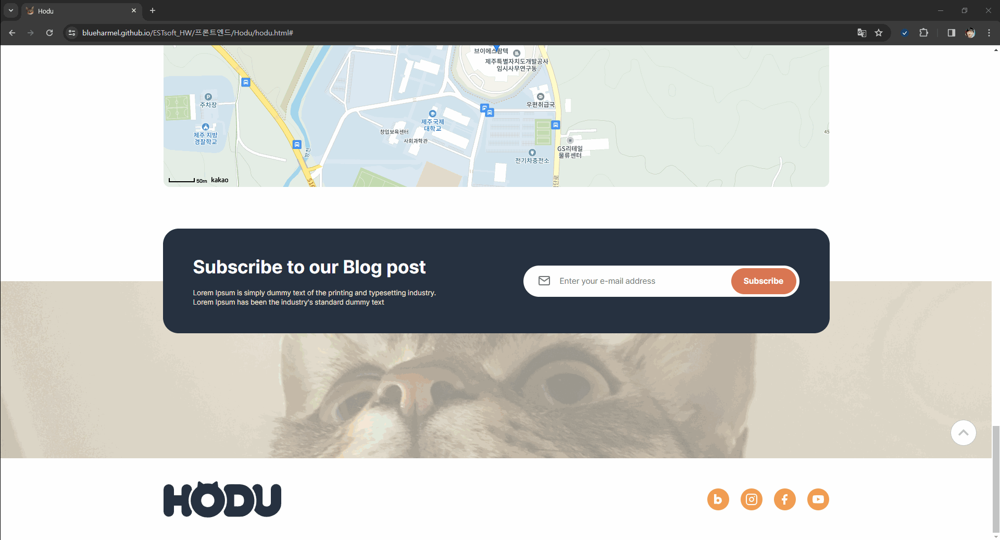

# ESTsoft_HW

오르미 과제 모음 레포입니다  
프로젝트명을 클릭하면 자세한 내용을 확인하실 수 있습니다!

  
Front-End 개인 프로젝트: Hodu

  <a list-style-type= 'none' href="https://blueharmel.github.io/ESTsoft_HW/%ED%94%84%EB%A1%A0%ED%8A%B8%EC%97%94%EB%93%9C/Hodu/hodu.html" target="_blank">프로젝트 페이지 보기</a>

오르미 4기의 첫 개인 프로젝트로 진행했습니다!
<h3>기능</h3>

header

- 페이지 내 이동기능  
</img>
- 고양이 가족사진 다운로드 버튼  
</img>

main

- 고양이 사진 무한 스크롤 컨테이너  
</img>
- 카카오 API 지도  
</img>
- 구독 기능 + 모달창  
</img>

footer

- SNS 연결 링크  
</img>
- 페이지 상단으로 이동  
</img>

<h3>사용 기술 스택</h3>
  
  
